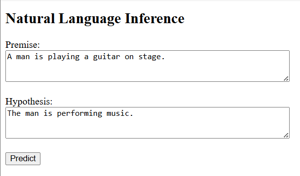
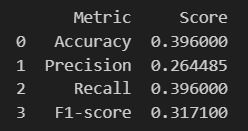

# 🧠 Natural Language Inference Web App  
### LSTM + Additive Attention | Flask | PyTorch

A deep learning web application that performs **Natural Language Inference (NLI)**.  
Users enter a **Premise** and a **Hypothesis**, and the model predicts:

- ✅ Entailment  
- ❌ Contradiction  
- ⚖️ Neutral  

Built using **PyTorch** and deployed with **Flask**.

---

## 🌟 Demo Preview

| Input | Output |
|-------|--------|
| Premise: A man is playing a guitar. <br> Hypothesis: A person is making music. | ✅ Entailment |

---

### 🛠 Requirements

- Python 3.8+

- Flask

- PyTorch

- NumPy

## 🚀 Features

- 🔤 Custom Tokenizer (max length = 128)
- 🧠 BiLSTM Encoder
- 🎯 Additive Attention Mechanism
- 📊 Softmax Classification
- 🌐 Clean Flask Web Interface
- 🛡 Handles `<pad>` and `<unk>` tokens safely

---

## 🏗 Model Architecture

```bash
app/
│
├── app.py # Flask backend
├── sbert_model.pth # Trained weights
├── vocab.pkl # Trained weights
├── templates/
│ └── index.html # Frontend UI

```

---

## ⚙️ Installation

### 1️⃣ Clone Repository

```bash
git clone https://github.com/YOUR_USERNAME/YOUR_REPO_NAME.git
cd YOUR_REPO_NAME
```

### Create Virtual Environment (Recommended)

```bash
python -m venv venv
```

For Windows: 

```bash
venv\Scripts\activate
```

For Mac/Linux:

```bash
source venv/bin/activate
```

### 3️⃣ Install Dependencies

```bash
pip install flask torch numpy
```

### ▶️ Run the Application

```bash
python app.py
```

Open in Browser:

```bash
http://127.0.0.1:5000/
```

### How to use?

1. Enter the sentences in the text boxes for both Premise and Hypothesis.

2. Then click "Predict" to see whether the result is Entailment, Contradiction, or Neutral. 

3. Below is the preview of the interface with the example inputs.  



### 📈 Future Improvements

- Deploy to Render / Railway / AWS

- Add REST API endpoint

- Add confidence score display

- Improve UI styling

### ⚠️ Limitations

- Limited trained dataset.

- The model relies on a fixed word2idx vocabulary built during training.

- Words not seen during training are mapped to <unk>

- Too many unknown words can reduce prediction accuracy

- No subword tokenization (like BPE or WordPiece)

### 📈 Future Improvements

- Retraining on larger portion of dataset. 

- Deploy to Render / Railway / AWS

- Add REST API endpoint

- Improve UI styling

## Appendix

### Evaluation matrices on validation set after training




